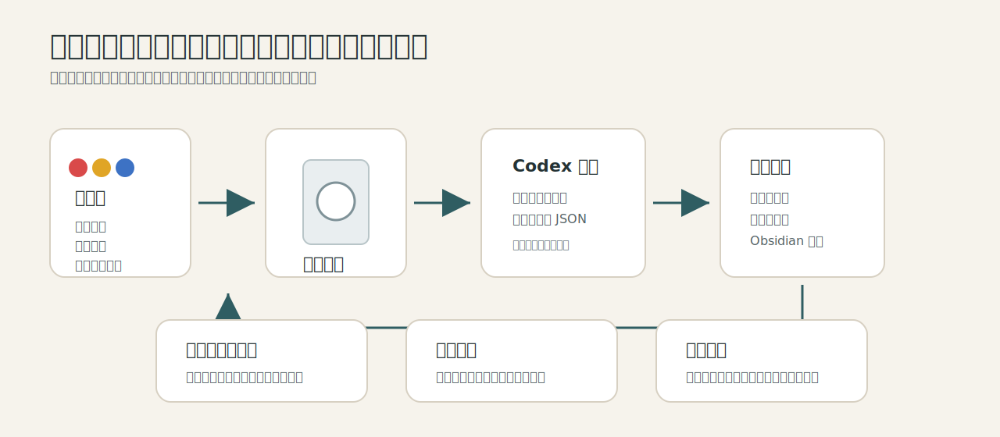
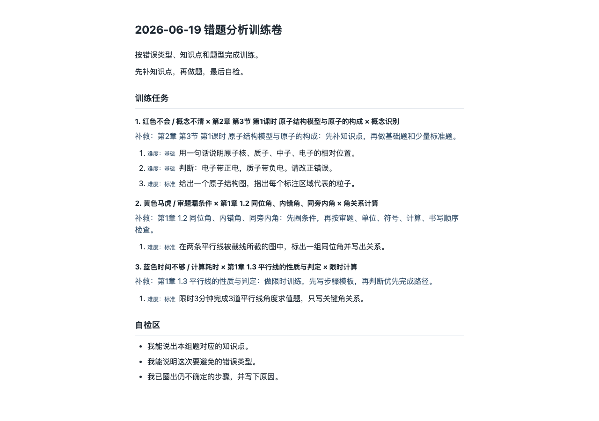
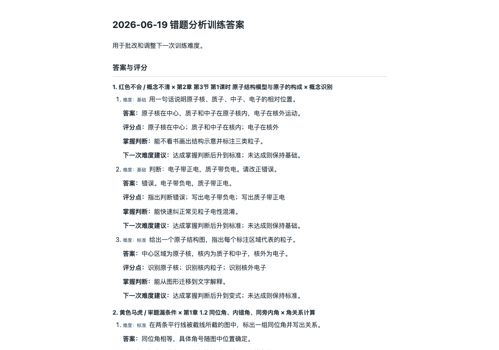
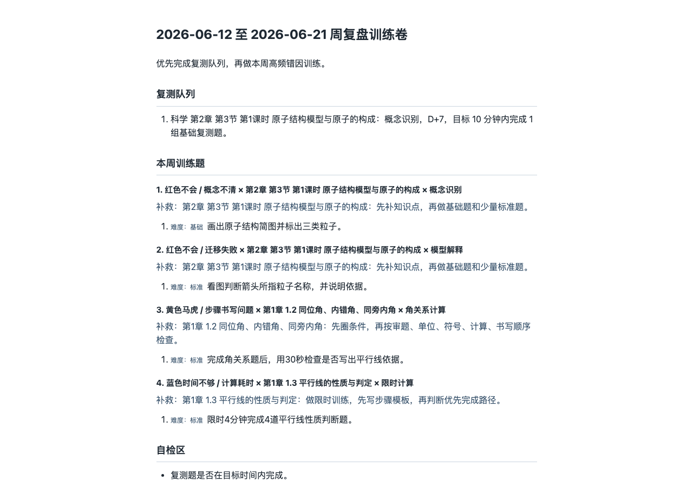

# Fish Study 家长使用手册

这份手册写给家长。你不需要懂代码，只需要知道每天怎么拍照、怎么让 Codex 生成训练卷、怎么打印、怎么看周复盘。



## 这个工具能帮你做什么

它不是一个自动判卷 App，也不是完整题库。

它现在做三件事：

1. 根据孩子的错题照片和红黄蓝标签，整理错因。
2. 结合当前已有知识库，生成学生训练卷和家长答案页。
3. 把错题、知识点和复习计划写进 Obsidian，方便后面周复盘。

当前可用知识库只覆盖：

| 年级 | 册别 | 学科 | 版本 | 知识点笔记 |
|---|---|---|---|---:|
| 七年级 | 下册 | 数学 | 浙教版 | 112 篇 |
| 七年级 | 下册 | 科学 | 浙教版 | 84 篇 |
| 七年级 | 下册 | 英语 | 人教版 | 53 篇 |

其他学科、七上、八下目前不要让工具硬猜。看不清或知识点不确定，就放进“待确认项”。

## 每天怎么用

### 第一步：给错题贴标签

只贴一级原因，不要一开始就分析太细。

| 颜色 | 含义 | 家长判断标准 |
|---|---|---|
| 红色 | 不会 | 知识点不会、方法不会、不会迁移 |
| 黄色 | 马虎 | 审题漏条件、计算错、单位符号错、步骤写漏 |
| 蓝色 | 时间不够 | 会做但慢、卡第一步、计算耗时、时间分配不合理 |

其他颜色、混合颜色、拍照偏色、看不清颜色，先不要自动判断错因，交给 Codex 放进“待确认项”。

### 第二步：上传照片并说一句话

在 Codex Desktop 里上传错题照片，然后只说：

```text
帮我生成错题知识点和测试题
```

Codex 会自动读取当前知识库范围、识别照片里的红黄蓝标注、整理错因、生成训练卷和答案页。家长不需要写 JSON，也不需要运行命令。

如果 Codex 看不清题目、颜色或知识点，它应该把这部分列为“待确认”，不要硬猜。

### 第三步：拿到学生训练卷和答案页

Codex 处理成功后会输出这些文件路径：

- 学生训练卷：`outputs/YYYY-MM-DD/wrong-question-training.html`
- 家长答案页：`outputs/YYYY-MM-DD/wrong-question-training-answers.html`
- Obsidian 错题记录：`$FISH_STUDY_VAULT_ROOT/20-错题归因/YYYY-MM-DD.md`

学生只看训练卷：



答案页给家长批改，不给孩子先看：



## 每周怎么用

周末做一次复盘，不要每天都做大报告。日常只要把错题事件沉淀下来。

在 Codex Desktop 里说：

```text
请根据本周错题归因记录和训练结果，生成 weekly_review JSON。
重点看反复知识点、红黄蓝错因分布、复测队列和下周优先级。
```

生成的 JSON 可以参考：

```text
samples/weekly-review-source.json
```

运行：

```bash
python3 -m fish_study_wiki.cli study-weekly-review samples/weekly-review-source.json
```

成功后会输出：

```text
outputs/YYYY-MM-DD/weekly-review.md
outputs/YYYY-MM-DD/weekly-review.html
outputs/YYYY-MM-DD/weekly-review-answers.html
$FISH_STUDY_VAULT_ROOT/40-复习计划/YYYY-MM-DD.md
```

周巩固测试卷长这样：



## 家长看哪些文件

### 打印给孩子

打开并打印：

```text
outputs/YYYY-MM-DD/wrong-question-training.html
outputs/YYYY-MM-DD/weekly-review.html
```

### 家长批改用

打开但不要提前给孩子：

```text
outputs/YYYY-MM-DD/wrong-question-training-answers.html
outputs/YYYY-MM-DD/weekly-review-answers.html
```

### 长期跟踪用

在 Obsidian 里看：

```text
$FISH_STUDY_VAULT_ROOT/20-错题归因/
$FISH_STUDY_VAULT_ROOT/40-复习计划/
$FISH_STUDY_VAULT_ROOT/10-教材Wiki/
```

建议从这个入口打开：

```text
$FISH_STUDY_VAULT_ROOT/00-入口/Fish Study 首页.md
```

## 什么时候不要继续生成

遇到下面情况，先停下来确认，不要让工具猜：

- 照片看不清题目。
- 错题学科不在当前 3 套资料里。
- Codex 找不到明确知识点。
- 孩子说“我不是不会，是没看清题”。
- 训练卷里出现了答案、解析、参考答案。

如果命令输出 `ERROR:`，先看错误信息。常见原因是：

| 错误情况 | 怎么处理 |
|---|---|
| 学生卷疑似含答案 | 修改 JSON 或渲染内容，确保答案只在答案页 |
| 知识点为空 | 补充明确知识点，或写 `待定位` 并放入待确认 |
| 低置信度没有待确认项 | 把对应问题加入 `uncertain_items` |
| 难度全是挑战题 | 降回基础题或标准题 |

## 一次完整日常流程

```bash
# 1. 看当前能用哪些资料
python3 -m fish_study_wiki.cli study-context

# 2. 上传错题照片给 Codex Desktop，让它生成 JSON
# 3. 用 JSON 生成训练卷和答案页
python3 -m fish_study_wiki.cli study-wrong samples/wrong-question-training.json

# 4. 确认知识库质量
python3 -m fish_study_wiki.cli verify
```

## 一次完整周复盘流程

```bash
# 1. 让 Codex Desktop 汇总本周错题，生成 weekly_review JSON
# 2. 生成周复盘报告、周巩固测试卷和答案页
python3 -m fish_study_wiki.cli study-weekly-review samples/weekly-review-source.json

# 3. 确认知识库质量
python3 -m fish_study_wiki.cli verify
```

## 最重要的使用原则

- 先少量题，稳定跑通，再扩大范围。
- 学生卷和答案页一定分开。
- 红色先补基础，不要直接上难题。
- 黄色重点练检查习惯。
- 蓝色重点练限时和路径选择。
- 没资料、看不清、不确定，就不要猜。
